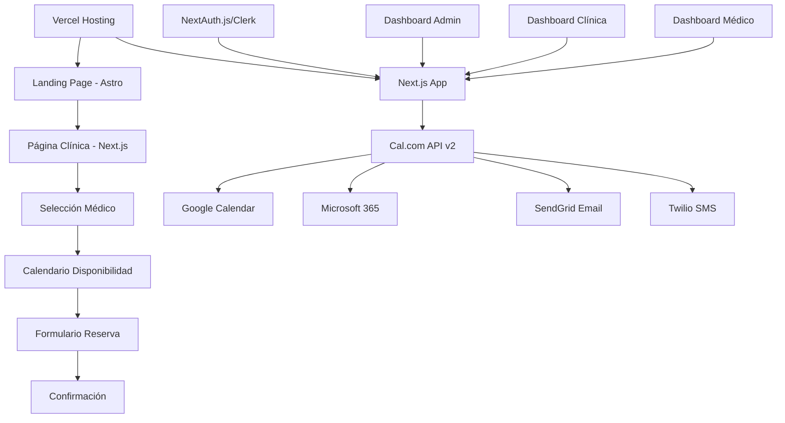

# CitaMedica - Documento de Diseño

## Resumen General

CitaMedica es una plataforma SaaS que funciona como un "headless frontend" sobre la infraestructura de Cal.com. La aplicación permite a médicos independientes y clínicas gestionar su disponibilidad mientras los pacientes reservan citas a través de una interfaz web intuitiva y profesional.

El sistema delega toda la lógica de programación, disponibilidad y gestión de calendarios a Cal.com API v2, enfocándose en proporcionar una experiencia de usuario premium específicamente diseñada para el dominio médico.

## Arquitectura del Sistema

### Arquitectura de Alto Nivel



### Stack Tecnológico

- **Frontend Principal**: Next.js con TypeScript
- **Landing Page**: Astro (máximo rendimiento y SEO)
- **Backend/Lógica de Citas**: Cal.com API v2
- **Autenticación**: NextAuth.js o Clerk
- **Hosting**: Vercel
- **Notificaciones**: SendGrid + Twilio (vía Cal.com)
- **Integración Calendarios**: Google Calendar/Microsoft 365 (vía Cal.com)

### Flujo de Datos Principal

1. **Carga Página Clínica** (`/[slugClinica]`):
   - Next.js obtiene el slug de la clínica
   - Consulta Cal.com API para encontrar el "Team" correspondiente
   - Obtiene todos los "Members" (médicos) del team
   - Renderiza la lista de médicos disponibles

2. **Selección de Médico**:
   - Usa el ID del médico para obtener sus "Event Types"
   - Consulta disponibilidad via `/availability` endpoint
   - Renderiza calendario con slots disponibles

3. **Creación de Cita**:
   - POST a `/bookings` con eventTypeId, hora y datos del paciente
   - Cal.com maneja sincronización y notificaciones automáticamente

## Componentes y Interfaces

### Componentes Públicos (Tema Claro)

#### Página de Clínica
```typescript
interface ClinicPageProps {
  clinic: {
    id: string;
    slug: string;
    name: string;
    description?: string;
    calcomTeamId: string;
  };
  doctors: Doctor[];
}

interface Doctor {
  id: string;
  name: string;
  specialty: string;
  avatar?: string;
  calcomUserId: string;
  eventTypes: EventType[];
}
```

#### Componente de Calendario
```typescript
interface CalendarBookingProps {
  doctorId: string;
  eventTypeId: string;
  availability: AvailabilitySlot[];
  onSlotSelect: (slot: TimeSlot) => void;
}

interface AvailabilitySlot {
  start: string;
  end: string;
  available: boolean;
}
```

#### Formulario de Reserva
```typescript
interface BookingFormProps {
  selectedSlot: TimeSlot;
  doctorInfo: Doctor;
  onSubmit: (data: PatientBookingData) => void;
}

interface PatientBookingData {
  name: string;
  phone: string;
  email?: string;
}
```

### Componentes de Dashboard (Tema Oscuro)

#### Dashboard Médico
```typescript
interface DoctorDashboardProps {
  doctor: Doctor;
  upcomingAppointments: Appointment[];
  todayStats: {
    totalAppointments: number;
    completedAppointments: number;
    nextAppointment?: Appointment;
  };
}
```

#### Dashboard Clínica
```typescript
interface ClinicDashboardProps {
  clinic: Clinic;
  doctors: Doctor[];
  allAppointments: Appointment[];
  clinicStats: {
    totalDoctors: number;
    totalAppointments: number;
    todayAppointments: number;
  };
}
```

#### Dashboard Admin Sistema
```typescript
interface SystemAdminDashboardProps {
  clinics: Clinic[];
  pendingRegistrations: Registration[];
  systemStats: {
    totalClinics: number;
    totalDoctors: number;
    totalAppointments: number;
  };
}
```

### Servicio de Integración Cal.com

```typescript
class CalcomApiService {
  // Gestión de usuarios
  async getUser(userId: string): Promise<CalcomUser>
  async getUsers(teamId?: string): Promise<CalcomUser[]>
  
  // Tipos de eventos
  async getEventTypes(userId: string): Promise<EventType[]>
  
  // Disponibilidad
  async getAvailability(
    userId: string, 
    dateFrom: string, 
    dateTo: string
  ): Promise<AvailabilitySlot[]>
  
  // Reservas
  async createBooking(data: CreateBookingRequest): Promise<Booking>
  async getBookings(
    userId: string, 
    filters?: BookingFilters
  ): Promise<Booking[]>
  
  // Teams (Clínicas)
  async getTeam(teamId: string): Promise<Team>
  async getTeamMembers(teamId: string): Promise<TeamMember[]>
  async addTeamMember(
    teamId: string, 
    memberData: AddMemberRequest
  ): Promise<TeamMember>
}
```

## Modelos de Datos

### Entidades Principales

#### Clínica (Mapea a Cal.com Team)
```typescript
interface Clinic {
  id: string;
  slug: string;
  name: string;
  description?: string;
  logo?: string;
  calcomTeamId: string;
  adminUserId: string;
  createdAt: Date;
  updatedAt: Date;
}
```

#### Médico (Mapea a Cal.com User/Team Member)
```typescript
interface Doctor {
  id: string;
  slug: string;
  name: string;
  specialty: string;
  bio?: string;
  avatar?: string;
  calcomUserId: string;
  clinicId?: string;
  isIndependent: boolean;
  createdAt: Date;
  updatedAt: Date;
}
```

#### Cita (Mapea a Cal.com Booking)
```typescript
interface Appointment {
  id: string;
  calcomBookingId: string;
  doctorId: string;
  patientName: string;
  patientPhone: string;
  patientEmail?: string;
  startTime: Date;
  endTime: Date;
  status: 'confirmed' | 'cancelled' | 'completed';
  eventTypeId: string;
  createdAt: Date;
}
```

## Diseño UI/UX

### Filosofía de Diseño
"Simplicidad Premium" - Interfaz minimalista inspirada en Cal.com/Cal.ai con la calidad de Apple y la simplicidad de Google.

### Temas

#### Tema Claro (Público)
- **Fondo**: Blanco (#FFFFFF) y gris muy claro (#F9FAFB)
- **Texto**: Negro (#111827) y gris oscuro
- **Acentos**: Colores neutros y pasteles
- **Uso**: Landing page y flujo de reserva del paciente

#### Tema Oscuro (Privado)
- **Fondo**: Azul marino/gris oscuro (#1A1A2E)
- **Texto**: Blanco/gris claro (#EAEAEA)
- **Acentos**: Morado/azul eléctrico (#7F56D9)
- **Uso**: Todos los dashboards autenticados

### Tipografía
- **Fuente**: Inter o Manrope (sans-serif moderna)
- **Jerarquía**: Bold, Medium, Regular
- **Estilo**: Titulares grandes y audaces

### Estructura de Páginas

#### Landing Page (Astro)
- Hero section con titular potente
- Animación de calendario interactivo
- Secciones con tarjetas y bordes redondeados
- Optimización SEO y rendimiento

#### Página de Clínica
- Tarjetas limpias de médicos con foto, nombre, especialidad
- Botón claro "Reservar Cita"
- Diseño responsive y accesible

#### Vista de Calendario
- Calendario central similar a Cal.com
- Información del médico a la izquierda
- Selección intuitiva de horarios

#### Dashboards
- Diseño modular con tarjetas
- Navegación lateral minimalista con iconos
- Información clave destacada con colores de acento

## Manejo de Errores

### Categorías de Errores

1. **Errores de Cal.com API**
   - Rate limiting (429)
   - Autenticación (401)
   - Recurso no encontrado (404)
   - Errores de servidor (5xx)

2. **Conflictos de Reserva**
   - Horario ya no disponible
   - Médico no disponible
   - Tipo de evento inválido

3. **Errores de Entrada del Usuario**
   - Formato de teléfono inválido
   - Campos requeridos faltantes
   - Selección de fecha/hora inválida

### Estrategia de Manejo

```typescript
class ErrorHandler {
  static handleCalcomError(error: CalcomApiError): UserFriendlyError {
    switch (error.status) {
      case 429:
        return new UserFriendlyError(
          'Sistema temporalmente ocupado. Intente en unos minutos.'
        );
      case 404:
        return new UserFriendlyError(
          'El médico o horario seleccionado ya no está disponible.'
        );
      case 409:
        return new UserFriendlyError(
          'Este horario ya fue reservado. Por favor seleccione otro.'
        );
      default:
        return new UserFriendlyError(
          'Error del sistema. Por favor intente nuevamente.'
        );
    }
  }
}
```

## Estrategia de Testing

### Testing Unitario
- Componentes React con React Testing Library
- Servicios de API con mocks de Cal.com
- Funciones utilitarias

### Testing de Integración
- Integración con Cal.com API
- Flujos de autenticación
- Proceso completo de reserva

### Testing E2E
- Journey completo del paciente
- Funcionalidad de dashboards
- Workflows de administración
- Compatibilidad cross-browser

## Consideraciones de Seguridad

### Autenticación y Autorización
- Gestión segura de sesiones
- Control de acceso basado en roles
- Gestión segura de API keys

### Protección de Datos
- Encriptación de datos en tránsito
- Almacenamiento mínimo de datos sensibles
- Cumplimiento GDPR
- Validación y sanitización de números telefónicos

## Optimización de Rendimiento

### Frontend
- Generación estática para landing page
- ISR para páginas de clínicas
- Optimización de imágenes
- Code splitting y lazy loading

### API
- Caché de respuestas de Cal.com
- Batching de requests
- UI optimista
- Prefetching de datos

### Monitoreo
- Real User Monitoring
- Tracking de tiempos de respuesta API
- Monitoreo de tasas de error
- Análisis de funnel de conversión

## Arquitectura de Despliegue

### Configuración Vercel
- Despliegues automáticos desde Git
- Configuraciones por ambiente
- Edge functions para rutas API
- Optimización CDN

### Gestión de Ambientes
- Desarrollo, staging y producción
- Instancias específicas de Cal.com por ambiente
- Gestión segura de variables de entorno
- Estrategia de migración de base de datos

Este diseño proporciona una base sólida para construir CitaMedica como una plataforma premium de reserva de citas médicas que aprovecha la infraestructura robusta de Cal.com mientras ofrece una experiencia de usuario personalizada para el dominio de la salud.